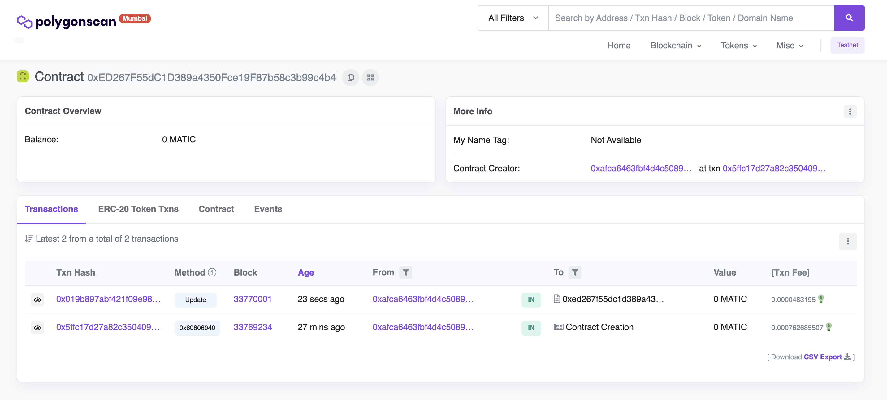

# Hello World Smart Contract
**Technologies:** *Hardhat | Ethers.js | Metamask | Alchemy SDK | Node | Polygon Mumbai Testnet*

**Tutorial:** [Web3 University](https://www.web3.university/tracks/create-a-smart-contract/interact-with-your-smart-contract)

**Note:** .env file contains the following:
- ALCHEMY_API_KEY
- ALCHEMY_API_URL
- METAMASK_PRIVATE_KEY
- CONTRACT_ADDRESS

**To Initialize:**
1. `git clone`
2. `npm install`
3. Setup [Metamask Wallet Chrome extension](https://chrome.google.com/webstore/detail/metamask/nkbihfbeogaeaoehlefnkodbefgpgknn?hl=en) and [Alchemy API key](https://www.alchemy.com/)
4. Configure .env file

**To Run:**
1. `npx hardhat compile`
2. Edit interact.js with new message for update function
2. `npx hardhat run scripts/interact.js`

**Deployed Smart Contract:**
